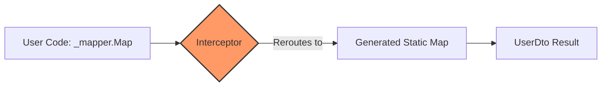

# How it Works

AutoMappic is fundamentally different from traditional .NET object mappers. While most libraries rely on runtime reflection and IL generation, AutoMappic shifts all the "heavy lifting" to compile-time using **Roslyn Interceptors** and **Source Generators**.

## The Architectural Shift

Traditional mappers like AutoMapper follow a **"Plan-at-Runtime"** strategy. AutoMappic follows a **"Verify-at-Compile-time"** strategy.

| Feature | AutoMapper | Mapster | Mapperly | AutoMappic |
| :--- | :--- | :--- | :--- | :--- |
| **Mapping Engine** | Runtime Reflection | Runtime Expressions | Source Generator | **Source Generator + Interceptors** |
| **Interception** | No (Manual Calls) | No (Manual Calls) | No (Manual Calls) | **Automatic (Roslyn Interceptors)** |
| **Performance** | O(N) Reflection cost | High (First call penalty) | Extreme (Statically generated) | **Extreme (Fully Inlined)** |
| **Native AOT** | **No** (Relies on IL Emit) | Limited (Via CodeGen tool) | Full Support | **100% Native AOT Compliance** |
| **Async Mapping** | No (Synchronous Only) | Partial (Via Mapster.Async) | No (Synchronous Only) | **First-Class Dual-Emission** |
| **Complex Mapping** | **ConstructUsing / Condition** | Full Support | Full Support | **Full Parity (Statically Generated)** |
| **IDataReader** | Convention-Based | No Native Support | No Native Support | **High-Performance Static Projections** |

---

## 1. Zero-Reflection Interception

The "Magic" of AutoMappic lies in [C# Interceptors](https://learn.microsoft.com/en-us/dotnet/csharp/whats-new/csharp-12#interceptors). 

When you write:
```csharp
var dto = _mapper.Map<UserDto>(user);
```

AutoMappic doesn't execute that `Map` method at runtime. Instead, the Source Generator finds the exact file and character position of that call and emits an **Interceptor**. This "hijacks" the call and reroutes it to a statically generated mapping method specifically optimized for those two types.



## 2. Compile-Time Validation (Zero Slop)

Because AutoMappic understands your code before it runs, it can provide immediate feedback. If you attempt to map a `Source` to a `Destination` where a property is missing or types are incompatible, you don't find out in Production--you find out in your IDE.

::: info
**Diagnostics AM0001-AM0013** ensure that your mapping profiles are always in sync with your models. If a build passes, the mapping is guaranteed to work.
:::

## 3. High-Performance Collection Mapping

AutoMappic avoids the allocation overhead of LINQ when mapping collections. Instead of generic `.Select().ToList()`, the generator emits optimized `for` loops that pre-allocate the destination capacity whenever possible.

```csharp
// Example of generated optimized collection mapping
public static List<UserDto> MapToUserDtoList(this List<User> source)
{
    var list = new List<UserDto>(source.Count);
    for (int i = 0; i < source.Count; i++)
    {
        list.Add(source[i].MapToUserDto());
    }
    return list;
}
```

## 4. Native AOT & Trimming

Modern cloud-native applications require small binaries and instant startup.
*   **No Reflection**: Trimmers can safely remove unused properties because they are never accessed via strings/reflection.
*   **No JIT**: All code is ready to be compiled to machine code (Native AOT) at build time.
*   **Sustainability**: Reduced CPU cycles for cold starts means lower carbon footprint for serverless environments.

## 5. Static Analysis & Host Compatibility

Unlike runtime libraries, a Source Generator like AutoMappic must run within the developer's IDE (Visual Studio, JetBrains Rider) and the `dotnet` build server. 

### Why we use Roslyn 4.14.0
To ensure maximum compatibility without sacrificing performance, we pin our analysis engine to **Microsoft.CodeAnalysis 4.14.0**. 
- **Backward Compatibility**: Compiling against Roslyn 5.x would break AutoMappic for any developer not yet on the absolute latest preview SDKs. 
- **Feature Baseline**: This version provides a robust baseline for C# 12 Interceptors and Incremental Generator APIs while ensuring the generator loads correctly across all stable versions of Visual Studio 2022 and .NET 9+.

*Factual Source: Comparison based on official documentation and community discussions from [riok/mapperly](https://github.com/riok/mapperly), [AutoMapper/AutoMapper](https://github.com/AutoMapper/AutoMapper), and [MapsterMapper/Mapster](https://github.com/MapsterMapper/Mapster) as of March 2026.*

[Next: Sustainability & ESG ->](./sustainability.md)
