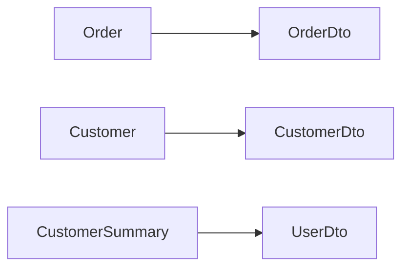

# CLI Tools reference

AutoMappic provides a comprehensive CLI toolset to help developers visualize their mappings and detect errors early in the development lifecycle.

## 1. Installation

To install the AutoMappic CLI, use the `dotnet tool` command:

```bash
dotnet tool install --global AutoMappic.Cli
```

Once installed, the `automappic` command will be available across your terminal.

## 2. Validating Mappings (`validate`)

The `validate` command scans your project for any potential mapping errors (such as unmapped properties) that could cause runtime issues or code quality regressions.

```bash
# Standard output
automappic validate path/to/project.csproj

# Machine-readable JSON output for CI/CD
automappic validate path/to/project.csproj --format json
```

### What `validate` checks:
- **Unmapped Properties (AM0001)**: Every destination property must be accounted for either via convention or explicit configuration.
- **Flattening Ambiguity (AM0002)**: Multiple source properties merging into the same destination property name.
- **Recursive Cycles (AM0003)**: Potential `StackOverflowException` scenarios found during mapping.
- **Full Diagnostic Suite**: Reports all 17 diagnostics (AM0001-AM0017).

### Output Formats:
- **text (default)**: Human-readable colored console output.
- **json**: Structured data for automated build gates.

## 3. Visualizing Mapping Graphs (`visualize`)

Understanding complex mapping graphs is a breeze with the `visualize` command. It generates an architectural overview of all your registered mappings.

```bash
automappic visualize path/to/project.csproj --format mermaid
```

### Supported Formats:
- **Mermaid**: Emits a `graph LR` diagram that you can paste into your documentation or view in Mermaid-enabled editors.

### Sample Mermaid Output:


## 4. Refactoring Codebases (`migrate`)

The `migrate` command (introduced in v0.7.0) provides an automated, source-to-source refactoring tool to migrate legacy `mapper.Map<TDest>(src)` mappings to AutoMappic's high-performance `src.MapTo<TDest>(mapper)` fluent syntax.

```bash
automappic migrate path/to/project.csproj
```

### What `migrate` does:
- Scans all `.cs` files (ignoring generated files).
- Safely replaces standard mapping calls with the v0.7.0 Fluent API layout.
- Provides a summary of modifications immediately.

## 5. Why Use the CLI?

- **CI/CD Integration**: Incorporate `automappic validate` into your build pipelines to prevent breaking mapping changes from being merged.
- **Architectural Clarity**: Use `visualize` to understand how data flows through your system and identify technical debt or circular dependencies.
- **Fast Feedback**: Detect unmapped properties instantly, before ever running your application.
- **Easy Upgrades**: Use `migrate` to automatically upgrade large legacy applications to modern AutoMappic syntax natively within seconds.

---

The AutoMappic CLI tools make your mapping logic transparent, reliable, and easy to maintain.
